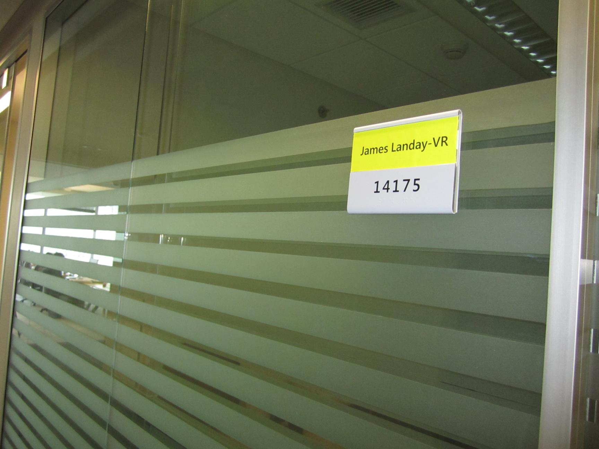

# PaddleOCR-VL-1.5.axera

> PaddleOCR-VL-1.5 在 Axera NPU 上的推理与模型转换示例工程.

- 目前支持 `Python` 语言, `C++` 代码正在开发中.
- 预编译模型可以从 [HuggingFace](https://huggingface.co/AXERA-TECH/PaddleOCR-VL-1.5) 下载.
- 如需自行编译转换模型请参考 [模型转换](/model_convert/README.md) 章节内容.

## 支持平台

- [x] AX650N
- [ ] AX620E

## 仓库结构

```bash
.
├── assets
│   ├── IMG_0462.JPG
│   └── IMG_0059.JPG
├── model_convert
│   ├── export_onnx.py
│   ├── prepare_calibration.py
│   ├── pulsar2_configs/config.json
│   └── vit-models/
├── python
│   ├── infer_axmodel.py
│   ├── infer_torch.py
│   ├── PaddleOCR-VL-1.5/
│   ├── PaddleOCR-VL-1.5_axmodel/
│   └── vit_models/
└── README.md
```

## 环境准备

将本项目 `clone` 到本地, 然后进入 `python` 文件夹:

```bash
$ git clone git@github.com:AXERA-TECH/PaddleOCR-VL-1.5.axera.git
$ cd PaddleOCR-VL-1.5.axera/python
```

同时也要在 AX 开发板上下载或安装以下支持库:

- 从 `huggingface` 下载 `PaddleOCR-VL-1.5` 模型:

    ```bash
    $ git clone https://huggingface.co/PaddlePaddle/PaddleOCR-VL-1.5
    ```

- 在开发板上安装配置 `pyaxengine`, [点击跳转下载链接](https://github.com/AXERA-TECH/pyaxengine/releases). 注意板端 `SDK` 最低版本要求:

    - AX650 SDK >= 2.18
    - AX620E SDK >= 3.12
    - 执行 `pip3 install axengine-x.x.x-py3-none-any.whl` 安装

## 快速运行

### 1. PyTorch 参考推理

> 可能需要配置运行环境, 请参考 `model_convert/README.md` 中的环境准备章节.

```bash
cd python
python infer_torch.py
```

### 2. AxModel 推理

在 `python/` 目录执行：

```bash

python3 infer_axmodel.py \
  --hf_model ./PaddleOCR-VL-1.5 \
  --axmodel_path ./PaddleOCR-VL-1.5_axmodel \
  --vit_model_path ./vit_models/vit_576x768.axmodel \
  --image_path ../assets/IMG_0462.JPG \
  --task ocr
```

`--task` 可选值：

- `ocr`
- `table`
- `chart`
- `formula`
- `spotting`
- `seal`

如果你希望使用 onnx 格式的 vit 模型, 可以将 `--vit_model_path` 参数替换为 `../model_convert/vit-models/paddle_ocr_vl_vit_model_1x2268x3x14x14.onnx`, 如下所示:

```bash
python3 infer_axmodel.py \
  --hf_model ./PaddleOCR-VL-1.5 \
  --axmodel_path ./PaddleOCR-VL-1.5_axmodel \
  --vit_model_path ../model_convert/vit-models/paddle_ocr_vl_vit_model_1x2268x3x14x14.onnx \
  --image_path ../assets/IMG_0462.JPG \
  --task ocr
```

输入下面的图像用于执行 OCR 任务:




输出结果:

```
Init InferenceSession: 100%|██████████████████████████████████████████████████████████| 18/18 [00:00<00:00, 33.44it/s]
[INFO] Using provider: AxEngineExecutionProvider
[INFO] Model type: 2 (triple core)
[INFO] Compiler version: 5.1-patch1 47548354
Model loaded successfully!
slice_indices: [0, 1, 2, 3, 4]
Slice prefill done: 0
Slice prefill done: 1
Slice prefill done: 2
Slice prefill done: 3
Slice prefill done: 4
answer >> James Landay-VR
14175
```

### 使用 gradio 交互体验

```bash
python3 gradio_demo.py \
  --hf_model ./PaddleOCR-VL-1.5 \
  --axmodel_path ./PaddleOCR-VL-1.5_axmodel \
  --vit_model ./vit_models/vit_576x768.axmodel
```

交互演示结果如下:


## 理论推理耗时统计 (AX650N)

该模型 prefill 阶段存在 6 个可用子图 (640 prefill + 1.5k decode), 共 18 层 Decode Layer, 每个子图耗时如下:

```sh
g1: 2.551 ms
g2: 2.883 ms
g3: 3.158 ms
g4: 3.413 ms
g5: 3.795 ms
g6: 4.007 ms
```

decode 阶段只有一个子图, 耗时如下:

```sh
g0: 0.949 ms
```

后处理耗时: `5.313 ms`.

- 模型最大 TTFT 为: 19.807 * 18 + 5.313 约为 361.8 ms.

- 模型解码速度为: 1000 / (0.949 * 18 + 5.313)  = 44.6 tokens/s.

ViT 模型耗时统计如下:

```sh
vit_576x768.axmodel: 1685.554 ms
```


## 技术讨论

- Github issues
- QQ 群: 139953715
